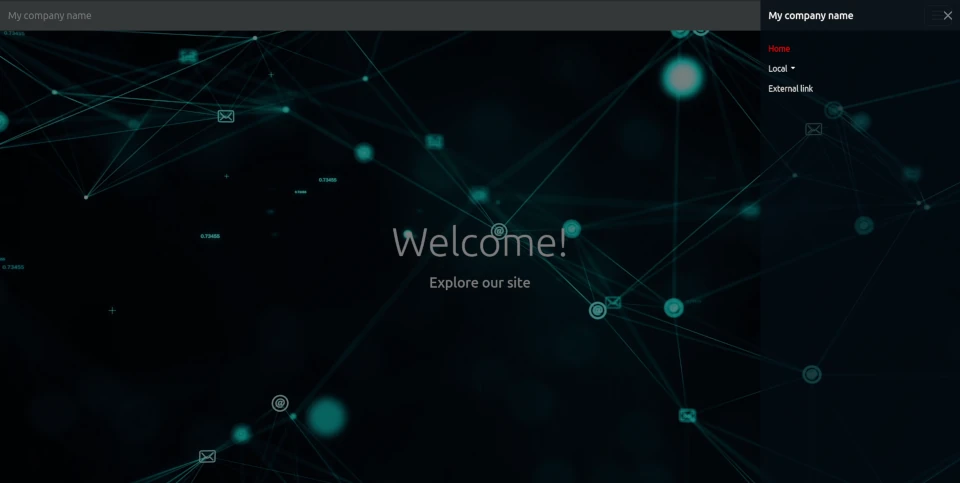

# Bootstrap WC Addon

**Bootstrap WC Addon** is a set of native **Web Components** that wrap and extend Bootstrap's own components, bringing them to the Custom Elements standard.
This lets you use familiar Bootstrap styles and behaviors inside HTML tags like `<bs-button>` or `<bs-modal>` — without manually writing all the Bootstrap markup.

<br>

## ✨ Features
- ✅ Uses **Bootstrap’s official components** under the hood
- ✅ Delivered as **native Web Components** (Custom Elements API)
- ✅ Works with or without a JavaScript framework
- ✅ Extensible styling via both Bootstrap classes and custom CSS
- ✅ Compatible with **Bootstrap 5**

<br>

## Example

[](https://din-demosida.example.com)

```html
<!DOCTYPE html>
<html lang="en">

<head>
	<meta charset="UTF-8">
	<title>Bootstrap WC Addon Test</title>
	<link rel="shortcut icon" href="#" />
	<script src="https://cdn.jsdelivr.net/npm/bootstrap@5.3.7/dist/js/bootstrap.bundle.min.js"></script>
	<link href="https://cdn.jsdelivr.net/npm/bootstrap@5.3.7/dist/css/bootstrap.min.css" rel="stylesheet"
		integrity="sha384-LN+7fdVzj6u52u30Kp6M/trliBMCMKTyK833zpbD+pXdCLuTusPj697FH4R/5mcr" crossorigin="anonymous">
	<link rel="stylesheet" href="https://cdn.jsdelivr.net/npm/bootstrap-wc-addon/css/style.min.css">
	<script src="https://cdn.jsdelivr.net/npm/bootstrap-wc-addon/dist/bootstrap-wc-addon.bundle.min.js"></script>
</head>

<body>
	<header>
		<bs-navbar brand="My company name" focus-color="primary"
			links='[{"href": "/", "label": "Home"}, {"Local": [{"href": "#top", "label": "Top"}, {"href": "#middle", "label": "Middle"}, {"href": "#bottom", "label": "Bottom"}]}, {"href": "https://www.anderssöderberg.se", "label": "External link", "target": "_blank"}]'>
		</bs-navbar>

		<bs-hero id="top" title="Welcome!" subtitle="Explore our site"
			background="https://videos.pexels.com/video-files/3129671/3129671-uhd_2560_1440_30fps.mp4"
			textColor="light">
		</bs-hero>
	</header>
</body>

</html>
```

<br>

## 📦 Installation

<!-- **Via npm**
```bash
npm install bootstrap-wc-addon
```-->

**Via CDN (jsDelivr)**
```html
<link rel="stylesheet" href="https://cdn.jsdelivr.net/npm/bootstrap-wc-addon/css/style.min.css">

<script src="https://cdn.jsdelivr.net/npm/bootstrap-wc-addon/dist/bootstrap-wc-addon.bundle.min.js"></script>
```

**Note**: Bootstrap 5 is required. Include it before this addon:
```html
<link href="https://cdn.jsdelivr.net/npm/bootstrap@5.3.7/dist/css/bootstrap.min.css" rel="stylesheet" integrity="sha384-LN+7fdVzj6u52u30Kp6M/trliBMCMKTyK833zpbD+pXdCLuTusPj697FH4R/5mcr" crossorigin="anonymous">

<script src="https://cdn.jsdelivr.net/npm/bootstrap@5.3.7/dist/js/bootstrap.bundle.min.js"></script>

```

<br>

## 🚀 Usage Example


```html
<bs-button variant="primary">Click me</bs-button>
```

<br>

## 📖 Documentation locally
```js
document.addEventListener("DOMContentLoaded", () => {
	const selectInstance = document.createElement('bs-navbar');
	console.log(selectInstance.documentation());
})
```

<br>

## 📄 License
MIT © 2025 Anders Söderberg
This project is not affiliated with the official Bootstrap project.
